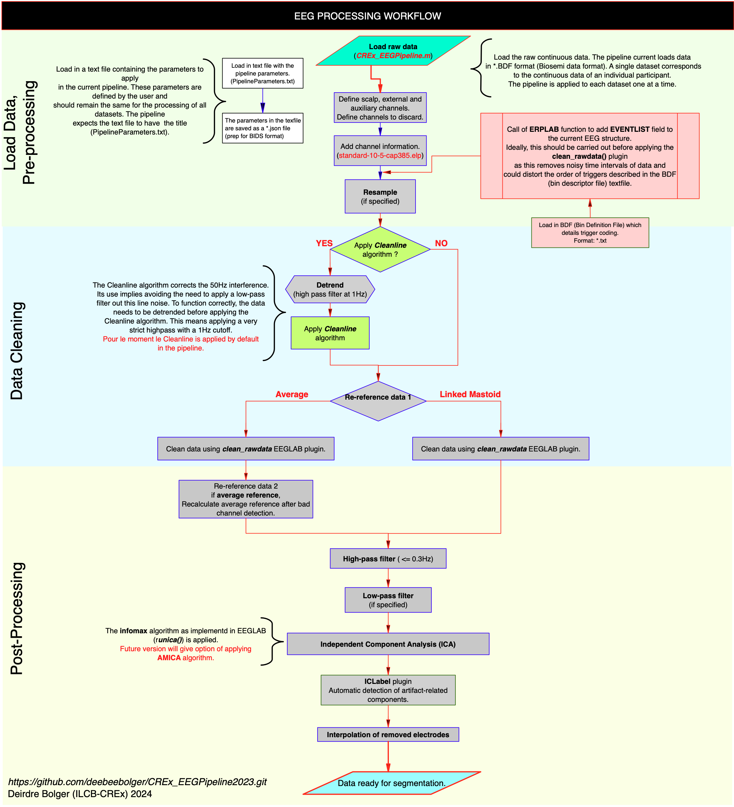

# CREx_EEGPipeline2023

## Requirements:
* **EEGLAB 2023** with the "clean_rawdata" plugin. The clean_rawdata plugin can be downloaded from https://github.com/sccn/clean_rawdata. But this plugin is included by default in recent versions of EEGLAB. 
* **PREP pipeline** downloaded and on the matlab search path. Download the PREP pipeline from https://vislab.github.io/EEG-Clean-Tools/
* **ERPlab toolbox** needs to be downloaded and on the matlab searchpath. ERP lab can be downloaded from: https://github.com/ucdavis/erplab/releases. ERP lab is used for the definition of Bin Descriptor Files (BDF) to define event codes.

:exclamation:  Remember to make sure that these toolboxes are on the Matlab path so that Matlab can find the respective functions.

To run the pipeline type the following in the command window: ```CREx_EEGPipeline() ```
The main script calls the following functions:
- ```Àdd_EventList()``` to add EventList to current EEG structure using ERPLAB binlister() function.
- ```pop_resample()``` EEGLAB function to resample data, which uses resample() function from Matlab's Signal Processing Toolbox
- ```removeTrend()``` PrepPipeline function to remove trend in the data using either a highpass filter or linear detrending. This pipeline uses a highpass filter by default.
- ```showSpectrum()```PrepPipeline function to plot channel spectra.
- ```removeLineNoise()```PrepPipeline function that applies the Cleanline algorithm to correct line noise.
- ```pop_clean_rawdata()```EEGLAB function from the *clean_rawdata* plugin.
- ```pop_eegfiltnew()```EEGLAB function that applies EEGLAB's default *Hamming windowed sinc FIR* filter.
- ```runica()```EEGLAB function to carry out ICA by applying the **infomax** algorithm.
- ```pop_iclabel()```Function from EEGLAB plugin **ICLabel** that automatically identifies artifact-related components.
- ```pop_epochbin()``` ERPLAB function to segment continuous data with Eventlist. 

The components of the pipeline are summarized in the following workflow diagram.




