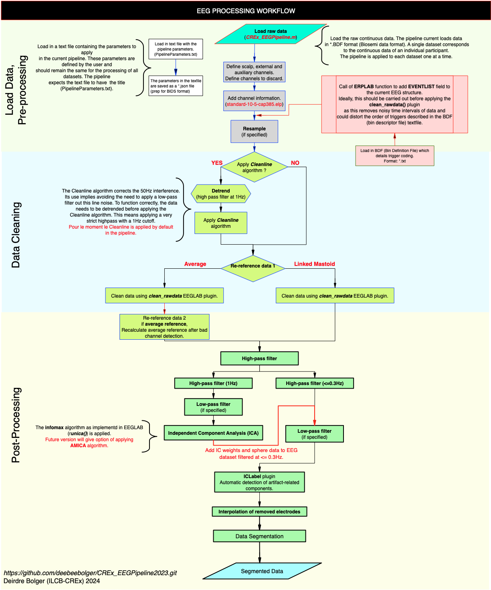

# CREx_EEGPipeline2023

To run the pipeline: type CREx_EEGPipeline in the command window.
## Requirements:
* **EEGLAB 2023** with the "clean_rawdata" plugin. The clean_rawdata plugin can be downloaded from https://github.com/sccn/clean_rawdata. But this plugin is included by default in recent versions of EEGLAB. 
* **PREP pipeline** downloaded and on the matlab search path. Download the PREP pipeline from https://vislab.github.io/EEG-Clean-Tools/
* **ERPlab toolbox** needs to be downloaded and on the matlab searchpath. ERP lab can be downloaded from: https://github.com/ucdavis/erplab/releases. ERP lab is used for the definition of Bin Descriptor Files (BDF) to define event codes.

To run the pipeline type the following in the command window: ```CREx_EEGPipeline() ```

The components of the pipeline are summarized in the following workflow diagram.



